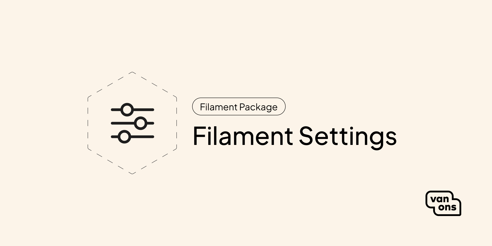

<p align="center"></p>

# Filament Settings

[](https://github.com/VanOns/filament-settings/releases)
[](https://packagist.org/packages/van-ons/filament-settings)
[](https://github.com/VanOns/filament-settings/issues)
[](https://github.com/VanOns/filament-settings/blob/main/LICENSE.md)

This plugin adds an easy-to-use settings page to your Filament admin panel.

## Quick start

### Compatibility

For certain Filament versions, changes have to be made that render the package backwards incompatible with the previous version.
Please see the table below to determine which version you need.

| Version                                                           | Filament         |
|-------------------------------------------------------------------|------------------|
| v2 (current)                                                      | \>=4.0 \| \>=5.0 |
| [v1](https://github.com/VanOns/filament-settings/tree/release/v1) | <4.0             |

**Please note:** the `main` branch will always be the latest major version.

### Installation

Start by installing the package via Composer:

```bash
composer require van-ons/filament-settings:^2.0
```

### Usage

You can create a new setting page by running the following command:

```bash
php artisan make:filament-settings-page GeneralSettings
```

Executing this command will create two files:

- `app/Filament/Pages/GeneralSettingsPage.php`: The settings page class.
- `app/Settings/GeneralSettings.php`: The settings class.

To modify the form, go to `GeneralSettingsPage`.
To modify the default values, go to `GeneralSettings`.

### Reading and writing settings

Use the `FilamentSettings` facade to get and set values anywhere in your application:

```php
use VanOns\FilamentSettings\Facade\FilamentSettings;

// Get a setting value
$value = FilamentSettings::getValue('general');
$value = FilamentSettings::getValue('general', 'default');

// Set a setting value
FilamentSettings::setValue('general', ['site_name' => 'My App']);
```

> **Note:** The key corresponds to the `$settingsName` property on your settings page class.

## Customizing the language files

If you want to customize the language files, you can publish them by running the following command:

```bash
php artisan vendor:publish --tag=filament-settings-lang
```
